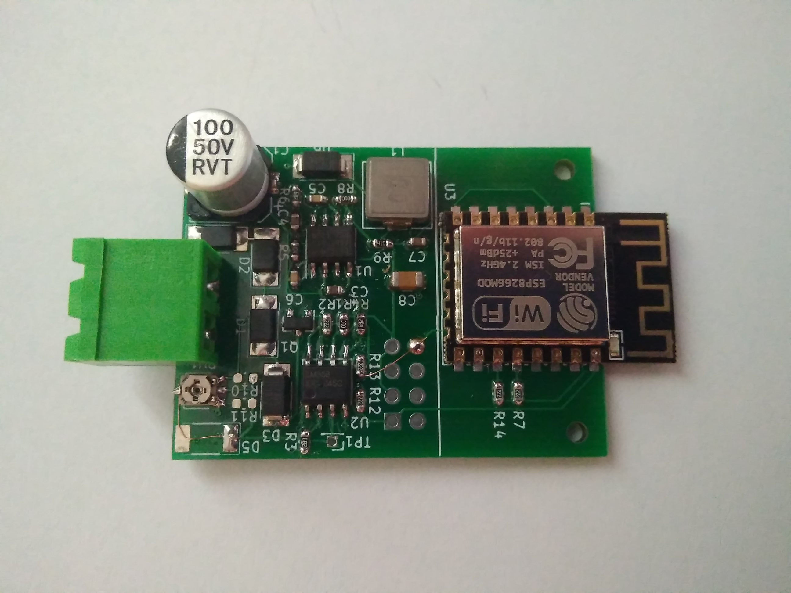

# eBUS to WiFi adapter

This repo conains KiCAD design of eBUS bus powered (without external supply) adapter to WiFi.

## Power consumption:

- 22mA@20V
- 36mA@10V

## Software

It can be used with following firmware: https://github.com/danielkucera/esp8266-arduino-ebus

For control software, ebusd can be used: https://github.com/john30/ebusd/

## Hardware

You can find latest schematic in [releases](https://github.com/danielkucera/ebus-adapter/releases)

If you are interested in buying bare PCB or finished module, contact me directly.
